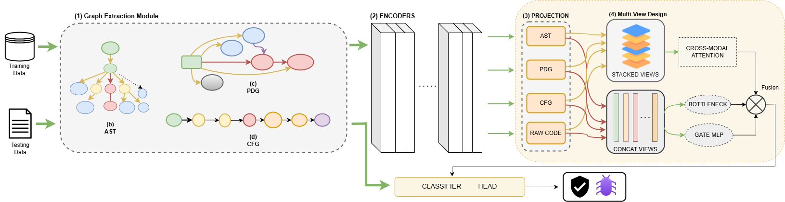

# SA-VAF: Sample-Adaptive View-Aware Fusion for Software Vulnerability Prediction

Official implementation of the paper:

> **SA-VAF: Sample Adaptive View Aware Fusion for Software Vulnerability Prediction**
> Mithilesh Pandey and Sandeep Kumar, Department of Computer Science and Engineering, IIT Roorkee

---

## Overview

SA-VAF is a multi-view deep learning framework for automated software vulnerability detection. It addresses a fundamental limitation of existing approaches — the assumption that all code representations contribute equally across all samples by introducing a **sample-adaptive view selection mechanism** that dynamically weights each code representation based on the input.

The key insight is that vulnerability patterns manifest differently depending on the representation:
- **Buffer overflows** are best captured via PDG data-flow patterns
- **Logic flaws** are most visible in CFG control structures
- **API misuse** and input sanitization issues surface in raw lexical tokens

SA-VAF models all four representations jointly and learns, per sample, which views matter most.

---

## Architecture

SA-VAF processes each input function through four stages:

1. **Graph Extraction** : Uses the [Joern](https://joern.io/) framework to extract four parallel views from source code:
   - Raw source code (lexical tokens)
   - Abstract Syntax Tree (AST)
   - Control Flow Graph (CFG)
   - Program Dependence Graph (PDG)

2. **Parallel Encoders** : Four independent RoBERTa-based Transformer encoders, one per view, produce contextualized `[CLS]` embeddings.

3. **Cross-Modal Attention** : A multi-head attention mechanism applied over the stacked view embeddings, enabling each view to attend to and be informed by the others.

4. **Adaptive Gating & Fusion** : An MoE-inspired MLP gating network assigns per-sample importance weights to each view. Final representation combines gated output, cross-modal attention, mean pooling, and a residual bottleneck projection.

```
zfused = α·zgate + β·a + γ·z̄ + δ·zbottleneck
```

The fused vector is passed to a classification head for binary vulnerability prediction.



---

## Results

SA-VAF achieves state-of-the-art performance on two standard C/C++ vulnerability benchmarks.

### FFmpeg+Qemu

| Method | Accuracy | Precision | Recall | F1 |
|---|---|---|---|---|
| VulDeePecker | 49.91 | 46.05 | 32.55 | 38.14 |
| Russell et al. | 57.60 | 54.76 | 40.72 | 46.71 |
| SySeVR | 47.85 | 46.06 | 58.81 | 51.66 |
| Reveal | 61.07 | 55.50 | 70.70 | 62.19 |
| Devign | 56.89 | 52.50 | 64.67 | 57.95 |
| GRACE | 59.78 | 53.94 | 82.13 | 65.11 |
| LineVul | 63.87 | 63.43 | 47.57 | 54.37 |
| **SA-VAF (Ours)** | **63.43** | **56.93** | **81.38** | **67.00** |

### Big-Vul

| Method | Accuracy | Precision | Recall | F1 |
|---|---|---|---|---|
| VulDeePecker | 81.19 | 38.44 | 12.75 | 19.10 |
| Russell et al. | 86.85 | 14.86 | 26.97 | 19.17 |
| SySeVR | 90.10 | 30.91 | 14.08 | 19.34 |
| Reveal | 87.14 | 17.22 | 34.04 | 22.87 |
| Devign | 92.78 | 30.61 | 15.96 | 20.90 |
| GRACE | 90.73 | 32.52 | 39.08 | 35.50 |
| LineVul | 99.02 | 95.13 | 87.01 | 90.89 |
| **SA-VAF (Ours)** | **99.17** | **97.56** | **87.30** | **92.15** |

SA-VAF significantly outperforms LineVul on Big-Vul (paired t-test: t=3.61, p=0.0057; Cohen's d=1.14).

---

## Repository Structure

```
SA-VAF/
├── main.py             # Training and evaluation entry point
├── model.py            # SA-VAF model architecture
├── requirements.txt    # Python dependencies
├── Dockerfile          # Docker environment setup
├── test.sc             # Joern script for graph extraction
└── train_logs/         # Training logs
```

---

## Setup

### Prerequisites

- Python 3.8+
- CUDA-compatible GPU (recommended: 16GB VRAM)
- [Joern](https://joern.io/) for graph extraction (required for preprocessing)

### Installation

**Option 1: Local**

```bash
git clone https://github.com/mithileshiitr/SA-VAF.git
cd SA-VAF
pip install -r requirements.txt
```

**Option 2: Docker**

```bash
docker build -t sa-vaf .
docker run --gpus all -it sa-vaf
```

---

## Datasets

SA-VAF is evaluated on two publicly available C/C++ vulnerability datasets:

- **FFmpeg+Qemu** — ~22.3K functions (~10.1K vulnerable, ~12.2K non-vulnerable). Available via the [Devign](https://sites.google.com/view/devign) project.
- **Big-Vul** — ~179K functions across 91 CWE types (~10.5K vulnerable, ~168.8K non-vulnerable). Available at the [Big-Vul repository](https://github.com/ZeoVan/MSR_20_Code_vulnerability_CSV_Dataset).

Both datasets use an 80:10:10 train/validation/test split.

---

## Graph Extraction

SA-VAF uses [Joern](https://joern.io/) to extract AST, CFG, and PDG views from source code. The included `test.sc` Scala script automates this process.

```bash
joern --script test.sc --params inputDir=<path_to_functions>,outputDir=<path_to_graphs>
```

Each extracted graph is serialized into a structured token sequence compatible with the Transformer encoders.

---

## Training

```bash
python main.py \
  --dataset ffmpeg \
  --data_dir <path_to_processed_data> \
  --output_dir ./checkpoints \
  --epochs 20 \
  --batch_size 32 \
  --lr 2e-5 \
  --num_heads 4 \
  --gate_hidden 512 \
  --gate_layers 4
```

Key hyperparameters:

| Parameter | Recommended Value | Description |
|---|---|---|
| `--num_heads` | 4 | Number of cross-modal attention heads |
| `--gate_hidden` | 512 | Hidden dimension of the gating MLP |
| `--gate_layers` | 4 | Depth of the gating MLP |
| `--lr` | 2e-5 | Learning rate |

---

## Pretrained Model

A pretrained SA-VAF checkpoint is available for download:

[SA-VAF](https://drive.google.com/file/d/1tVl_OMZilFyBjheJugjnlpBkuvXaWbA8/view?usp=drive_link) |

Download and place the checkpoint in a `checkpoints/` directory before running evaluation.

---

## Evaluation

```bash
python main.py \
  --eval_only \
  --checkpoint ./checkpoints/<model_file> \
  --dataset bigvul \
  --data_dir <path_to_processed_data>
```

Reported metrics: Accuracy, Precision, Recall, F1-score (binary and per-CWE weighted F1).

---

## Gating Analysis

SA-VAF's gating coefficients provide interpretable view-level explanations. On vulnerable samples, PDG and CFG views receive approximately **4× and 2× higher weights** respectively compared to non-vulnerable samples, confirming that the model selectively leverages structural information for security reasoning.

